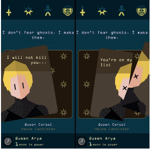

# Reigns

Dans ce dépôt, vous trouverez une (BONNE) implémentation du jeu REIGNS. 

## Qu'est-ce que Reigns ?

Dans le jeu Reigns, vous incarnez un roi ou une reine (ou autre !)  qui possède 4 jauges d’appréciation : 
* le clergé
* le peuple
* l'armée
* les finances

Différents sujets vont défiler avec des demandes. Pour chaque demande, deux manières de répondre : Soit favorablement, soit défavorablement. Cela se traduit par un défilement sur la gauche ou sur la droite dans la version originale. 
 
Chaque choix aura des conséquences différentes sur les jauges d’appréciation. Dès qu’une des jauges atteint le maximum ou se vide complètement, c’est perdu ! 

Dans l’illustration suivante, vous voyez deux captures d’écran de la version « Game of Thrones » du jeu. En haut, vous retrouvez les 4 jauges d’appréciation. En dessous des jauges, vous retrouvez la demande et la photo du sujet. Sur la gauche, il s’agit de ce qui arrive si vous glissez l’image à gauche, sur la droite, ce qui arrive si vous glissez l’image sur la droite.

La version proposée dans ce TP est une version textuelle de ce jeu.